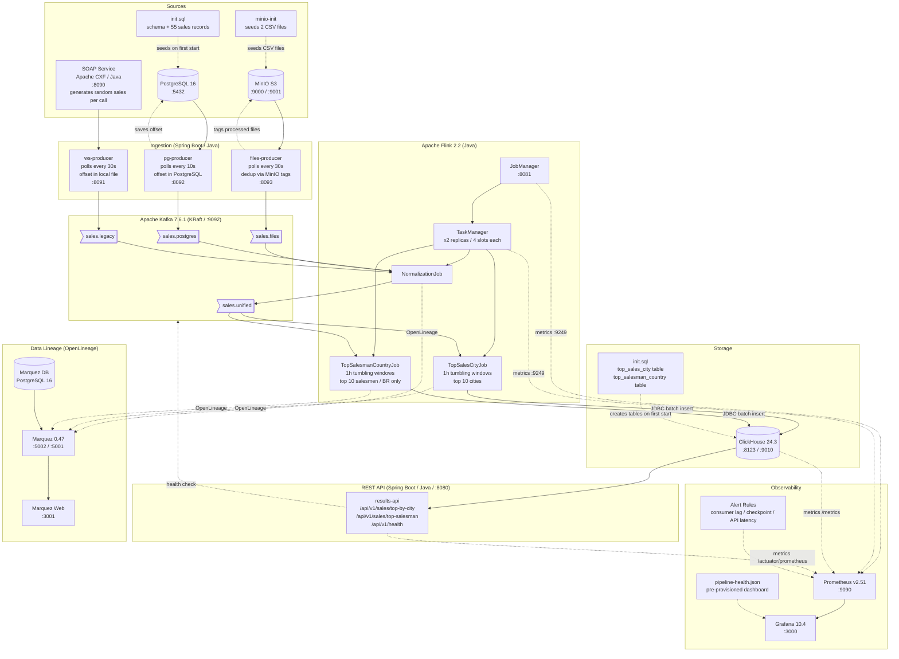

# Architecture

```mermaid
graph TB
    subgraph Sources
        PG[(PostgreSQL 16<br/>:5432)]
        PG_INIT[init.sql<br/>schema + 55 sales records]
        MINIO[(MinIO S3<br/>:9000 / :9001)]
        MINIO_INIT[minio-init<br/>seeds 2 CSV files]
        SOAP[SOAP Service<br/>Apache CXF / Java<br/>:8090<br/>generates random sales per call]
    end

    subgraph Ingestion ["Ingestion (Spring Boot / Java)"]
        PGP[pg-producer<br/>polls every 10s<br/>offset in PostgreSQL<br/>:8092]
        FP[files-producer<br/>polls every 30s<br/>dedup via MinIO tags<br/>:8093]
        WSP[ws-producer<br/>polls every 30s<br/>offset in local file<br/>:8091]
    end

    subgraph Kafka ["Apache Kafka 7.6.1 (KRaft / :9092)"]
        KT1>sales.postgres]
        KT2>sales.files]
        KT3>sales.legacy]
        KT4>sales.unified]
    end

    subgraph Flink ["Apache Flink 2.2 (Java)"]
        JM[JobManager<br/>:8081]
        TM[TaskManager<br/>x2 replicas / 4 slots each]
        NJ[NormalizationJob]
        TSC[TopSalesCityJob<br/>1h tumbling windows<br/>top 10 cities]
        TSCN[TopSalesmanCountryJob<br/>1h tumbling windows<br/>top 10 salesmen / BR only]
        JM --> TM
        TM --> NJ
        TM --> TSC
        TM --> TSCN
    end

    subgraph Storage
        CH[(ClickHouse 24.3<br/>:8123 / :9010)]
        CH_INIT[init.sql<br/>top_sales_city table<br/>top_salesman_country table]
    end

    subgraph API ["REST API (Spring Boot / Java / :8080)"]
        REST[results-api<br/>/api/v1/sales/top-by-city<br/>/api/v1/sales/top-salesman<br/>/api/v1/health]
    end

    subgraph Observability
        PROM[Prometheus v2.51<br/>:9090]
        GRAF[Grafana 10.4<br/>:3000]
        ALERTS[Alert Rules<br/>consumer lag / checkpoint / API latency]
        DASH[pipeline-health.json<br/>pre-provisioned dashboard]
    end

    subgraph Lineage ["Data Lineage (OpenLineage)"]
        MRQ_DB[(Marquez DB<br/>PostgreSQL 16)]
        MRQ[Marquez 0.47<br/>:5002 / :5001]
        MRQW[Marquez Web<br/>:3001]
    end

    %% Source seeding
    PG_INIT -.->|seeds on first start| PG
    MINIO_INIT -.->|seeds CSV files| MINIO

    %% Source to Ingestion (with offset persistence)
    PG --> PGP
    PGP -.->|saves offset| PG
    MINIO --> FP
    FP -.->|tags processed files| MINIO
    SOAP --> WSP

    %% Ingestion to Kafka
    PGP --> KT1
    FP --> KT2
    WSP --> KT3

    %% Kafka to Flink Processing
    KT1 --> NJ
    KT2 --> NJ
    KT3 --> NJ
    NJ --> KT4

    KT4 --> TSC
    KT4 --> TSCN

    %% Flink to ClickHouse
    TSC -->|JDBC batch insert| CH
    TSCN -->|JDBC batch insert| CH
    CH_INIT -.->|creates tables on first start| CH

    %% ClickHouse to API
    CH --> REST
    REST -.->|health check| Kafka

    %% Lineage
    NJ -.->|OpenLineage| MRQ
    TSC -.->|OpenLineage| MRQ
    TSCN -.->|OpenLineage| MRQ
    MRQ_DB --> MRQ
    MRQ --> MRQW

    %% Observability
    JM -.->|metrics :9249| PROM
    TM -.->|metrics :9249| PROM
    CH -.->|metrics /metrics| PROM
    REST -.->|metrics /actuator/prometheus| PROM
    ALERTS -.-> PROM
    PROM --> GRAF
    DASH -.-> GRAF
```