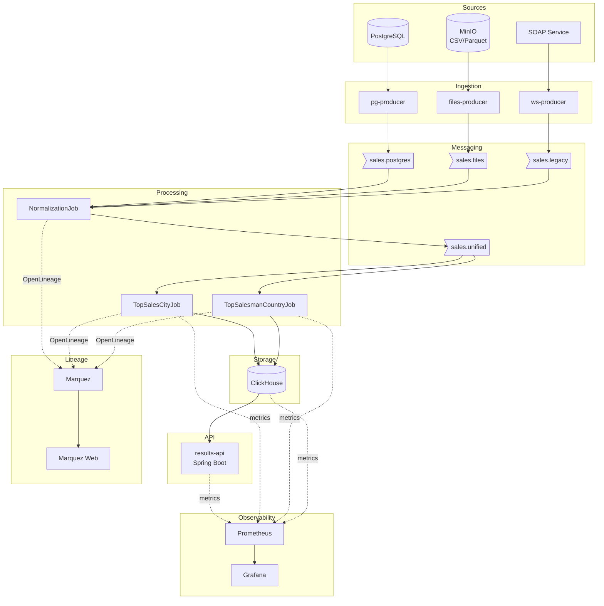

# Architecture

```mermaid
graph TB
    subgraph Sources
        PG[(PostgreSQL)]
        MINIO[(MinIO<br/>CSV/Parquet)]
        SOAP[SOAP Service]
    end

    subgraph Ingestion
        PGP[pg-producer]
        FP[files-producer]
        WSP[ws-producer]
    end

    subgraph Messaging
        KT1>sales.postgres]
        KT2>sales.files]
        KT3>sales.legacy]
        KT4>sales.unified]
    end

    subgraph Processing
        NJ[NormalizationJob]
        TSC[TopSalesCityJob]
        TSCN[TopSalesmanCountryJob]
    end

    subgraph Storage
        CH[(ClickHouse)]
    end

    subgraph API
        REST[results-api<br/>Spring Boot]
    end

    subgraph Observability
        PROM[Prometheus]
        GRAF[Grafana]
    end

    subgraph Lineage
        MRQ[Marquez]
        MRQW[Marquez Web]
    end

    PG --> PGP
    MINIO --> FP
    SOAP --> WSP

    PGP --> KT1
    FP --> KT2
    WSP --> KT3

    KT1 --> NJ
    KT2 --> NJ
    KT3 --> NJ
    NJ --> KT4

    KT4 --> TSC
    KT4 --> TSCN

    TSC --> CH
    TSCN --> CH

    CH --> REST

    NJ -.->|OpenLineage| MRQ
    TSC -.->|OpenLineage| MRQ
    TSCN -.->|OpenLineage| MRQ
    MRQ --> MRQW

    REST -.->|metrics| PROM
    TSC -.->|metrics| PROM
    TSCN -.->|metrics| PROM
    CH -.->|metrics| PROM
    PROM --> GRAF
```